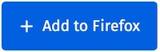

<h1 align="center">Hacker Tab Extension</h1>

Replace new tab screen with GitHub trending projects.

  
   
  

    <em>Credits: Illustration by <a href="https://undraw.co/">unDraw</a></em>
  

 

**[It's on Product Hunt](https://www.producthunt.com/posts/hacker-tab)**

**Tutorial**: [How to use React.js to create a cross-browser extension in 5 minutes](https://levelup.gitconnected.com/how-to-use-react-js-to-create-chrome-extension-in-5-minutes-2ddb11899815?source=friends_link&sk=055e5c73e0dd11fd8cb25130242f388e).

Download in Chrome Web Store:

Download in Firefox Addons:

 

API in use: [github-trending-api](https://github.com/huchenme/github-trending-api)

## License

MIT
