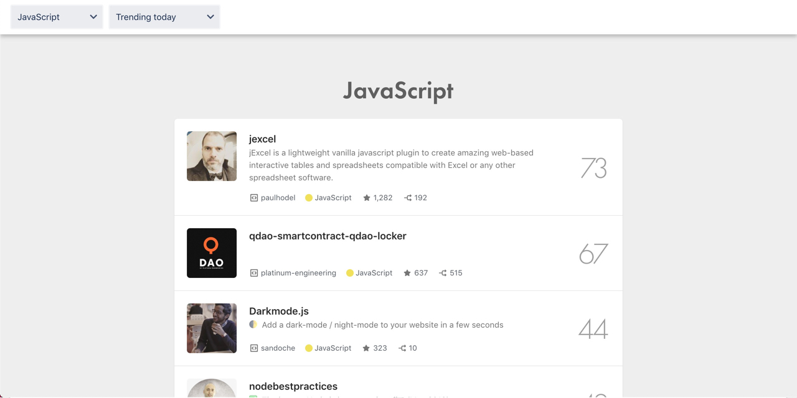

## What is Hacker Tab Extension

Hacker Tab replace browser new tab screen with GitHub trending projects, so that developer get to know trending repositories everyday. It loads trending project periodically in background so you do not need to wait for loading every time you open a new tab.

## Install

Trusted by developers! Install Hacker Tab from [Chrome Web Store](https://chrome.google.com/webstore/detail/hacker-tab/ibomigipadcieapbemkegkmadbbanbgm) or [Mozilla Add-ons Store](https://addons.mozilla.org/en-US/firefox/addon/hacker-tab/).

## View Online

[View Online](https://hacker-tab-extension.now.sh) version of extension.

## Backers

Thank you to all our backers! 🙏

## Feedback

Just write me an [email](mailto:chen@huchen.dev), or create an [issue](issues).

## Give us a rating

If you enjoy using it, please help to write a review at [Chrome Web Store](https://chrome.google.com/webstore/detail/hacker-tab/ibomigipadcieapbemkegkmadbbanbgm) or [Mozilla Add-ons Store](https://addons.mozilla.org/en-US/firefox/addon/hacker-tab/), and star this repo. This will motivate me a lot :)

## Related

- [github-trending-api](https://github.com/huchenme/github-trending-api): The missing APIs for GitHub trending projects and developers.
- [How to use React.js to create a cross-browser extension in 5 minutes](https://levelup.gitconnected.com/how-to-use-react-js-to-create-chrome-extension-in-5-minutes-2ddb11899815?source=friends_link&sk=055e5c73e0dd11fd8cb25130242f388e).
- Hacker Tab on [Product Hunt](https://www.producthunt.com/posts/hacker-tab).
- [Internal Components](https://hacker-tab-components.netlify.com)

## Disclaimer

Hacker Tab is not affiliated with, sponsored by, or endorsed by GitHub Inc.
